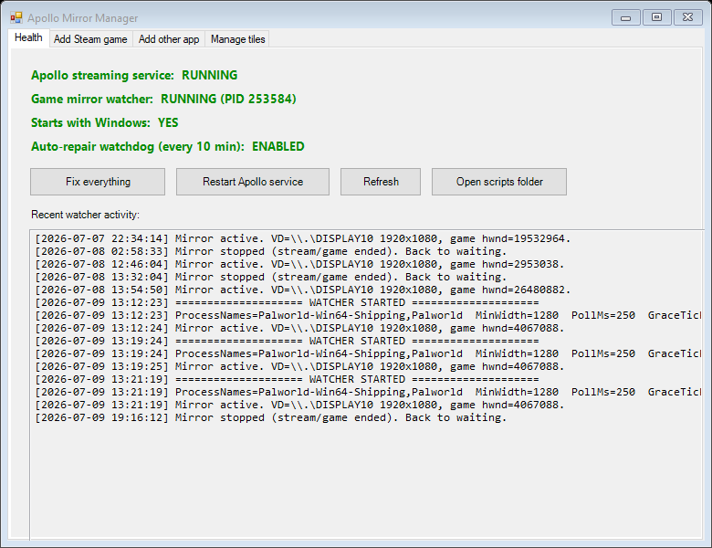
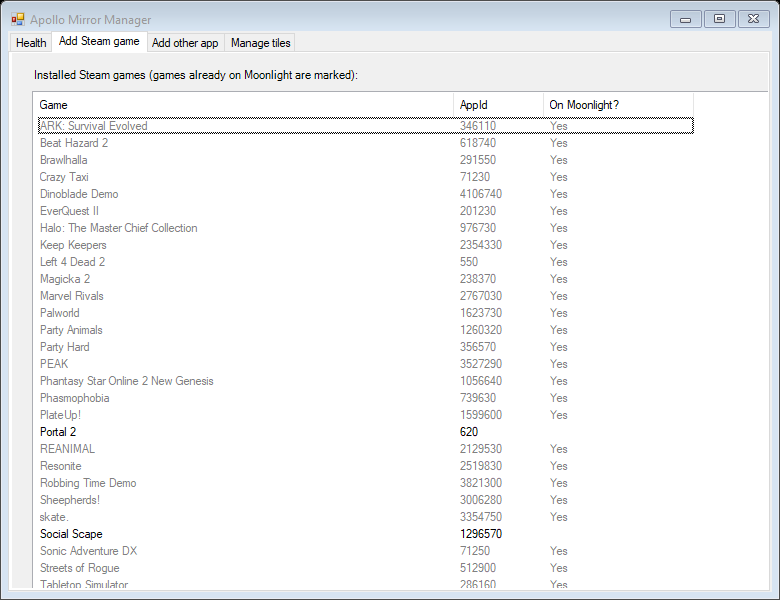
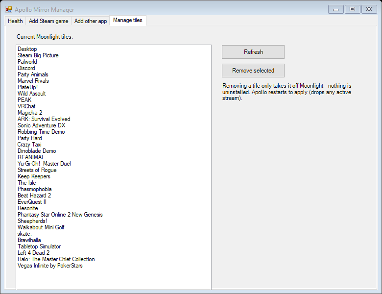

# Apollo Mirror Manager

**Stream just your game to a handheld (Moonlight) while your PC monitor stays completely untouched — and manage it all from a simple desktop app.**



## What problem does this solve?

Normally, streaming a game from your PC to a handheld (Retroid, Steam Deck, phone, etc.) with [Apollo](https://github.com/ClassicOldSong/Apollo) / Sunshine + [Moonlight](https://moonlight-stream.org/) means one of these compromises:

- Your **whole desktop** gets streamed (wallpaper, notifications, everything), or
- Your physical monitor gets **disabled or rearranged** during the stream, or
- The game window gets **moved** onto a virtual display, so you can't see it on your PC anymore.

This project does none of that. It works like the **SteamVR dashboard**: a **live copy** of just the game window is shown on Apollo's virtual display (which is what gets streamed), while the **real game stays on your physical monitor**, fully playable and visible. Your desktop is never rearranged, darkened, or touched.

It does this with the Windows **DWM thumbnail API** — the same zero-copy, GPU-composited live-preview mechanism Windows itself uses for taskbar previews and Alt-Tab. Overhead is negligible.

**Apollo Mirror Manager** is the friendly GUI on top: it health-checks and self-repairs the whole pipeline, and lets you add any Steam game (or any other program) to Moonlight in two clicks — cover art included.

## What's in the box

| Piece | What it does |
|---|---|
| `mirror-manager.ps1` | The GUI app (screenshots below): health checks, one-click repair, add/remove Moonlight tiles |
| `mirror-watcher.ps1` | The background worker: waits for a stream to start, then live-copies the game window onto the virtual display |
| `watchdog-mirror.ps1` | Scheduled task (every 10 min): restarts the watcher if something killed it |
| `launch-app.ps1` / `close-app.ps1` | Generic per-tile launch/close logic Apollo calls (idempotent launch, optional close-on-quit) |
| `add-app.ps1` | Command-line way to register a tile (the GUI calls this for you) |
| `install.ps1` / `uninstall.ps1` | One-shot setup / teardown |

Everything is plain PowerShell + VBScript — no binaries to trust, read all of it yourself.

## Requirements

- **Windows 10/11** with Windows PowerShell 5.1 (built in)
- **[Apollo](https://github.com/ClassicOldSong/Apollo)** installed as the streaming host (the Sunshine fork with built-in virtual display support). Default install path `C:\Program Files\Apollo` is assumed.
- **[Moonlight](https://moonlight-stream.org/)** on the device you stream to
- Games must run in **Borderless Window** mode (not exclusive Fullscreen — Windows can't live-copy exclusive fullscreen; you'd get a black screen)

## Install (step by step, for newbies)

1. **Install Apollo** on your gaming PC and **pair Moonlight** on your handheld/device with it (follow Apollo's own docs for pairing — do this first and make sure a plain "Desktop" stream works).

2. **Download this repo**: click the green **Code** button above → **Download ZIP** → right-click the ZIP → **Properties** → check **Unblock** (important, Windows blocks downloaded scripts) → **Extract All**.

   *Or, if you have git:* `git clone https://github.com/aguirretim/apollo-mirror-manager.git`

3. Open the extracted folder, **right-click `install.ps1` → Run with PowerShell**.

   The installer copies the scripts to `%LOCALAPPDATA%\ApolloScripts`, makes the watcher start with Windows, sets up the self-repair watchdog, puts **Apollo Mirror Manager** on your Desktop, and starts the watcher immediately. No admin prompt needed for install.

4. **If you run Bitdefender or another aggressive antivirus — do this now, not later.** Add the folder `C:\Users\<you>\AppData\Local\ApolloScripts` to the exception lists. On Bitdefender that's **two separate places**: *Antivirus → Settings → Manage Exceptions* **and** *Advanced Threat Defense → Settings → Manage Exceptions*. A hidden PowerShell process doing screen-copy API calls looks suspicious to behavioral AV, and it will silently kill the watcher otherwise. (The watchdog restarts it, but you'll get 10-minute dead spots.)

5. Double-click **Apollo Mirror Manager** on your Desktop (accept the one UAC prompt — it needs admin because Apollo's config lives in Program Files). Go to the **Add Steam game** tab and add your games.

6. In Moonlight on your device, connect to your **game's tile** (not "Desktop"). The game launches on your PC monitor, and your device shows a live copy of just that window. Done.

## Using the app

### Health tab


Four green/red status lines tell you if the whole pipeline is alive:

- **Apollo streaming service** — the thing Moonlight connects to
- **Game mirror watcher** — the background worker that copies the game onto the stream. If this is red, your device shows an empty/black desktop instead of the game.
- **Starts with Windows** — whether the watcher will survive a reboot
- **Auto-repair watchdog** — the every-10-minutes "restart it if it died" task

Anything red? Click **Fix everything**. It restarts/repairs all four in one go. The log box below shows the watcher's recent activity ("Mirror active" lines = it's working). The tab auto-refreshes every 5 seconds.

**Restart Apollo service** is there for when you've changed tiles/config — note it drops any active stream.

### Add Steam game tab



Lists **every installed Steam game** across all your Steam library drives, and marks the ones already on Moonlight (greyed out). Select one or more, click **Add selected game(s) to Moonlight**, and for each game it automatically:

- figures out the game's **process name** (so the mirror knows which window to copy) by scanning the game's folder and scoring the exes — Unreal `...\Binaries\Win64\*-Shipping.exe` style layouts are detected correctly,
- downloads the game's **Steam cover art** for a proper Moonlight tile,
- wires up **idempotent launch** (connecting while the game is already running just mirrors it — never relaunches) and, if the checkbox is on, **close-on-quit** (quitting the stream closes the game *only if the stream launched it* — if you were already playing on your PC, it leaves it alone),
- restarts Apollo so the tile appears (uncheck that box if you're mid-stream and want to apply later).

### Add other app tab

For anything that isn't a Steam game: Discord, an emulator, a launcher, any .exe. Click **Browse**, pick the program, and the name/process fields auto-fill. For always-on apps like Discord, **uncheck** "Close the app on my PC when I quit the stream" so quitting the stream never kills it.

### Manage tiles tab



Shows every tile currently on Moonlight; select one and **Remove selected** takes it off (with an automatic `apps.json` backup, and the game itself is of course not uninstalled). The Desktop tile is protected.

## How it works (the 2-minute architecture tour)

```
Moonlight (your device)
   │  connects to a game tile
   ▼
Apollo (Windows service) ── creates a virtual display + runs the tile's
   │                        "detached" command: launch-app.ps1
   │                          • writes mirror-target.txt (which process to mirror)
   │                          • launches the game IF not already running
   ▼
mirror-watcher.ps1 (always running in your login session)
   • notices: virtual display exists + target game window exists
   • shows ONE borderless black form covering the virtual display
   • registers a DWM thumbnail: form ⟵ live copy of the game window
   • Apollo streams the virtual display → your device sees just the game
   • stream ends → hides the form, goes back to waiting
```

Key design points, learned the hard way:

- **The watcher must run in your interactive login session.** Apollo's own command hooks run on an isolated desktop that cannot see your windows — that's why this is a logon-started background script rather than an Apollo command.
- **One persistent form, never recreated.** Creating/destroying WinForms windows in a long-lived script eventually wedges the message pump ("alive but not mirroring"). The watcher creates one form at startup and only ever shows/hides it.
- **Debounced teardown.** Games' window handles flicker to 0 during loading screens and alt-tabs. The watcher requires ~2 s of *continuous* absence before it tears down, so the mirror never flaps.
- **Ownership markers.** `launch-app.ps1` drops a `<name>.owned.flag` file only when *it* launched the game. `close-app.ps1` (run by Apollo when the stream ends) closes the game only if that marker exists. That's how "quit stream closes the game, but never the session I started myself on the PC" works.
- **Watchdog + PID file.** The watchdog finds the watcher by command line, with a PID-file fallback (a non-elevated process can't read an elevated process's command line — without the fallback you'd get duplicate watchers).

## Configuration you might want

### Force the stream resolution (recommended)

By default Apollo sizes the virtual display to whatever the client asks for. To always get 1080p regardless of client, add these three lines to Apollo's `sunshine.conf` (Apollo folder → `config`), then restart the Apollo service:

```
dd_configuration_option = ensure_active
dd_resolution_option = manual
dd_manual_resolution = 1920x1080
```

The first line is the master switch — without it the other two are silently ignored. Use `ensure_active` only; `ensure_primary` / `ensure_only_display` will rearrange or blank your real monitor, which defeats the point of this project.

### Watcher tuning

`mirror-watcher.ps1` params (edit the Startup shortcut / vbs if you want non-defaults): `-MinWidth 1280` (ignore small side-monitors when looking for the virtual display), `-PollMs 250` (tick rate), `-GraceTicks 8` (ticks of "game gone" before teardown).

## Troubleshooting

| Symptom | Cause / fix |
|---|---|
| Device shows desktop/black instead of the game | Watcher not running. Open the Manager → Health → **Fix everything**. If it dies again immediately → antivirus (next row). |
| Watcher keeps dying / everything stops working every few hours | Your antivirus is behavior-killing it. Add `%LOCALAPPDATA%\ApolloScripts` to exceptions — on Bitdefender in **both** Antivirus *and* Advanced Threat Defense lists. |
| Game shows as a black rectangle on the device | Game is in exclusive **Fullscreen**. Switch it to **Borderless Window** in the game's video settings. |
| New tile doesn't appear in Moonlight | Apollo wasn't restarted. Health tab → **Restart Apollo service** (or re-add with the restart checkbox on). |
| Mirror shows the wrong window | The process-name guess was wrong. Tile's process names live in Apollo's `apps.json` (the `-ProcessNames` argument) — fix the name (Task Manager → Details shows the real exe name, drop the `.exe`). |
| Mouse doesn't work on the streamed app | Expected. The real window is on your PC monitor, so Moonlight's mouse maps to the wrong place. **Controller input works fine** (Apollo's virtual gamepad goes to the focused game). This setup is for controller games; mouse-driven apps are view-only. |
| Stream disconnects when adding games | Adding a tile restarts the Apollo service, which drops streams. Uncheck "Restart Apollo after adding" and restart later. |
| Watcher didn't start after reboot | Check Health tab → "Starts with Windows". **Fix everything** recreates the Startup entry. Some AVs delete Startup entries — see the antivirus row. |

Log files (all in `%LOCALAPPDATA%\ApolloScripts`, and the Health tab shows the important one): `mirror-watcher.log` (mirror activity), `watchdog.log` (only writes when it had to restart the watcher), `launch-<app>.log` (per-tile launch/close decisions).

## Uninstall

Right-click `uninstall.ps1` → Run with PowerShell. It stops the watcher and removes the watchdog task and shortcuts. Remove any tiles you added (Manage tiles tab) *before* uninstalling if you want them gone from Moonlight too.

## Credits & license

Built around [Apollo](https://github.com/ClassicOldSong/Apollo) by ClassicOldSong and [Moonlight](https://moonlight-stream.org/). The mirroring technique is the Windows DWM thumbnail API (`dwmapi.dll`).

MIT license — see [LICENSE](LICENSE). No warranty; scripts modify Apollo's `apps.json` (always with timestamped backups next to the original).
